# Coin Detection and Classification using CV-based Strategies

Coin identification and recognition systems may drammatically enhance the extended operation of vending machines, pay phone systems and coin counting machines. Coin recognition is a difficult task in machine learning and computer vision problems because of its various rotations and widely different patterns. Therefore, in this project, an efficient CV-based algorithm is designed to be robust and invariant to rotation, translation and scaling.

### Project Objectives
The primary purpose of this project is to develop a detector capable of finding and classifying Euro coins in images without relying on CNNs. The provided solution is required to be able to segment the regions of the image where Euro coins are visible, and determine the value of each coin (if its value is visible, if occlusions are not severe).

### Project Organization
```
.
├── data/                                       : Contains all coins images
├── src/                                        : Contains report images
├── CMakeLists.txt                              : CMake instructions list
├── coins.cpp                                   : Main routine
├── coins_toolbox.cpp                           : Coin class (/w Classification Code)
├── coins_toolbox.hpp                           : Coin class Header file
└── README.md                                   : Project Report 
```

## Data Description
Hi-res Euro coin images have been retrieved from the internet to be used as references and they are directly loaded from the `data/ref` folder. In order to load the reference images and contextually apply the desired feature detection procedure, the `load dataset` method is used. \
The source images used to tune the parameters and test the performances of the classification method are stored in the `data` folder and should be passed to the code as argument. Images with Euro coins visible from the reverse side and non Euro coins are also considered as source images for testing purposes, however the contribution of such coins is neglected in the overall results evaluation.

## Coin Detection
The first operation needed for the purposes of this project is the detection of size and placement of the different coins depicted in the scene image. For this purpose, it is considered the fact that coins are characterized by a circular shape; therefore the _Hough Transform_ for circles is performed on a black and white version of the original image with gaussian smoothing (kernel size equal to 1.5% of the smaller dimension of the scene). \
In order to detect the most coins from images with different size, view point, and number of coins, the `cv::HoughCircles` parameters are tuned as follow:
- `minDist`: same as `minRadius` (overlap is permitted)
- `Th` (Canny’s higher threshold): tuned via trackbar (empirically tested good value: 145)
- `circ_th` (accumulator threshold): tuned via trackbar (empirically tested good value: 60)
- `minRadius`: 1/15 of the smaller dimension of the input image
- `maxRadius`: 1/3 of the smaller dimension of the input image

Finally, for each circle detected, a `Coin` object is constructed using the corresponding portion of the scene image.

## Coin Classification
For each detected coin, the classification task is divided into two steps:
1. Color classification
2. Template matching

### Color Classification
First of all, 1 and 2 Euro coins are instantly classified comparing the thresholded values of the Saturation channel from the HSV colorspace. In particular, the optimal threshold is obtained using the Otsu’s method and, in order to evaluate a match, a logic XOR is performed between the detected coin and a reference (1 or 2 Euro) coin. Finally, the two coins match if the mean color of the resulting logic XOR is lower than the color threshold value (selectable in the main method). Note that with this procedure even down facing coins can be classified!
An example of the procedure and possible results is as follows:
<p align="center">
  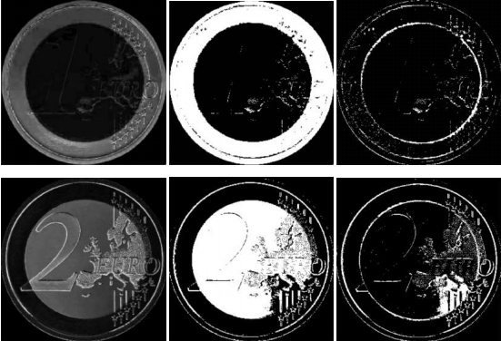<br>
  <i>Color matching of 1 and 2 Euro coins in HSV colorspace thresholding the Saturation channel. From left to right: 1 and 2 Euro coins Saturation channel; images thresholded with Otsu’s method; expected result for the logic XOR of a match.</i>
<br><br><br>
  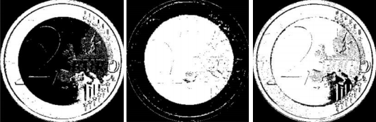<br>
  <i>Examples of XORs resulting from non matches.</i>
</p>

If the detected coin is not classified as 1 or 2 Euro then it should be a Euro cent one. Therefore a further color-based procedure is designed in order to distinguish between golden cents (50, 20, 10) and Copper ones (5, 2, 1). \
As it can be observed in the following figure, in the a-channel of the Lab color space copper shines. 
<p align="center">
  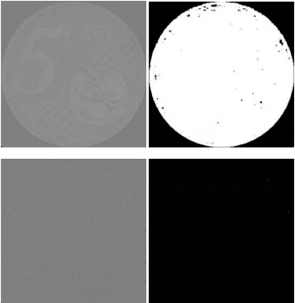<br>
  <i>Copper (top) and golden (bottom) cents a-channel and their respective thresholded version.</i>
</p>
Using this peculiar behavior, thresholding the a-channel of the detected coin (empirically selected value equal to 135), golden cents and Copper ones can be easily distinguished.

### Template Matching
After the color classification 1 and 2 euro coins should have been already classified and cents should be correctly divided by color (copper and golden). For the purpose of recognizing the correct label for a cent coin belonging to one of the two classes a feature matching approach is used. \
SIFT, SURF or ORB features (accordingly to the selection in the main method) are extracted from the center part (70% of the coin radius) of each unclassified coin. The decision of excluding the outer part from the feature detection is given by the fact that all coins share a similar contour and a black background, therefore all the detected features along the borders would have been meaningless.
<p align="center">
  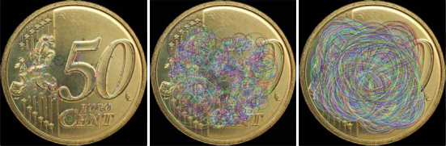<br>
  <i>Example of SIFT, SURF and ORB features extracted from a 50 cent coin.</i>
</p>

Once the features are extracted from the detected coin, they are matched with the ones extracted from the reference coins of the corresponding color (i.e. copper or golden). All matches are refined keeping only the ones with distance lower than the threshold value `max_distance` and consistent with the homography found by `cv::findHomography` with the RANSAC method. The final estimated label for the detected coin is set equal to the label of the reference coin with the highest number of refined matches. Note that if the number of `refined_matches` is lower then the threshold value uncertainty th, the detected coin is labelled as 'no coin' (−1).

## Final Results
### Coin Detection
The circle Hough transform was expected to present some problems working on occluded coins and non vertical viewpoint, however, with the introduction of the trackbars, almost all the coins from each of the proposed images can be correctly segmented from the surroundings. In particular, excluding the scene in file 'img2.jpg' where there are uncountably many coins, 48 coins over 49 are detected from the provided images without introducing any false positive.
<p align="center">
  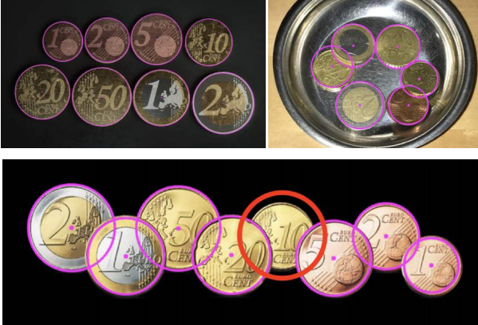<br>
  <i>Results of the coin detection with the Hough transform. The coin circled in red was not
detected (note that it can be segmented at the cost of introducing a false positive).</i>
</p>

### Color Based Classification
The effectiveness of the preliminary color-based classification can be clearly appreciated referring to the confusion matrix of the 48 detected coins reported in Table 1. 
<p align="center">
  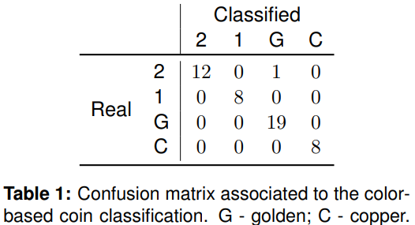
</p>
As expected, the critical points for this classifier are the quality of the detection and the handling of occluded coins. Indeed, if a coin is not perfectly segmented (e.g. due to viewpoint changes) or if two coins overlap, the corresponding thresholded image can be drastically different from what expected. Two examples of misclassification due to this behavior can be appreciated analyzing the following figures.
<p align="center">
  <br>
  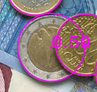<br>
  <i>Misclassified coin due to severe occlusion.</i>
<br><br>
  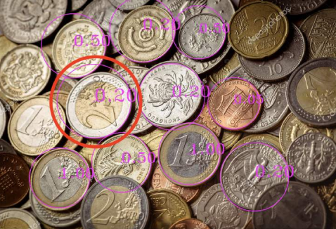<br>
  <i>Misclassified coin due to tilting.</i>
</p>

### Feature Based Classification
As concerns the feature matching step, it is important noticing that, referring to the ORB features, keeping the same patch size for both the reference coin and the detected one yield to poor results in terms of matches. Therefore in the feature extraction step, even if they should be scale independent, the patch size and the edge threshold are adapted to the size of the detected coin, yielding to better results. \
Finally, the overall results associated with the detection and classification of up-facing, not severely occluded (the number should be visible) Euro coins (including the ones from the scene in file 'img2.jpg') are summarized in the following tables.
<p align="center">
  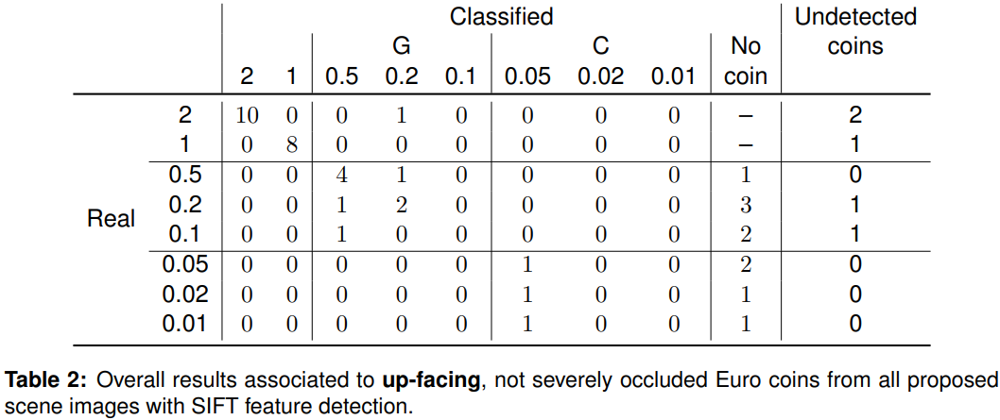
  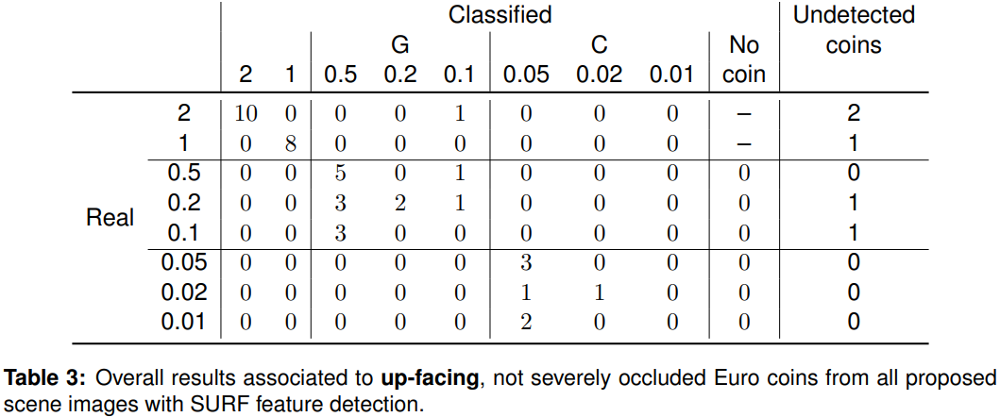
  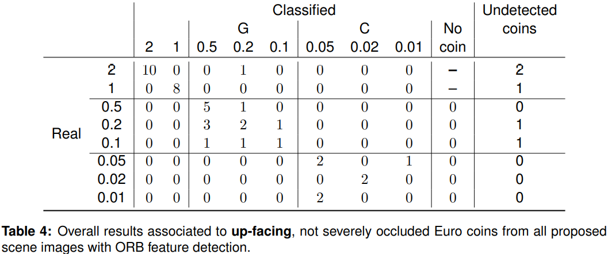
</p>

Comparing the obtained results, the ORB features seem to perform better than the others and in particular 50 cent and 5 cent coins are the most likely to be correctly classified. However, it is clear that the feature matching approach does not guarantee the desired performace. This result was somehow expected looking at the obtained matches. In spite of the fact that the refined matches between same value coins are expected to be consistent and the ones from different value coins are not, the refined matches between same value coins do not seem to be distinguishable from the ones from different value coins, as it can be appreciated in the following example.
<p align="center">
  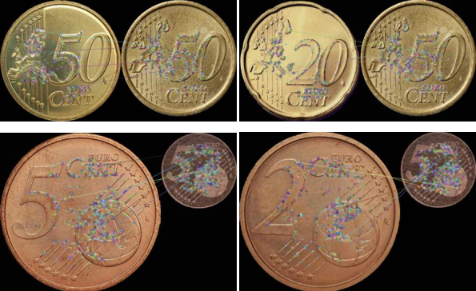<br>
  <i>Examples of refined matches from ORB features.</i>
</p>

## Conclusions
While the coin detection and color matching strategies yield to great results, it is not the case for feature matching. In future works, to improve the obtained results, the classification task could be faced with a bag of words approach.
